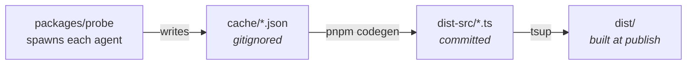

# agent-metadata

[](https://www.npmjs.com/package/acp-agent-metadata)
[](packages/data/dist-src/agents/)

**English** | [简体中文](README.zh-CN.md)

Typed metadata for [Agent Client Protocol (ACP)](https://agentclientprotocol.com) coding agents — their session modes, slash commands, capabilities, and auth methods — shipped as a tree-shakeable npm package.

## Why

Querying an agent's capabilities live isn't always possible: the agent may be offline, unreachable from a remote environment, or too expensive to launch on every request. This repo probes each ACP agent once, then ships the captured metadata as static, typed data you can import anywhere — no live agent required.

The probe (`packages/probe`) launches each agent over stdio, interrogates its `initialize` / `session/new` responses, and codegens the results into `acp-agent-metadata`.

Covers **34 agents**, including `gemini`, `cline`, `cursor`, `claude-acp`, `codex-acp`, `kimi`, `opencode`, and `goose`. Full list in [`packages/data/dist-src/agents/`](packages/data/dist-src/agents/).

## Packages

This is a pnpm workspace with two packages:

| Package | Path | Published | Purpose |
| --- | --- | --- | --- |
| `acp-agent-metadata` | [`packages/data`](packages/data) | Yes (via changesets) | Tree-shakeable typed agent metadata. ESM + CJS, zero runtime dependencies. |
| `@agent-metadata/probe` | [`packages/probe`](packages/probe) | No (`private: true`) | The probe tool that produces the metadata. CI-only. |

## Install

```bash
npm install acp-agent-metadata
# or
pnpm add acp-agent-metadata
```

Requires Node.js 22+ at runtime; development and CI use Node 24 (see [`.node-version`](.node-version)). The package bundles the ACP SDK types inline, so `@agentclientprotocol/sdk` is **not** a runtime dependency.

## Usage

Import one agent (tree-shakeable — only that agent's data lands in your bundle):

```ts
import { agent } from 'acp-agent-metadata/gemini'

const modes = agent.modes // SessionMode[]
const commands = agent.commands // AvailableCommand[]
const authMethods = agent.authMethods
```

Import the full aggregate:

```ts
import { agents } from 'acp-agent-metadata'

const clineModes = agents.cline.modes
const ids = Object.keys(agents) // all 34 agent ids
```

Import only the types:

```ts
import type { AgentMetadata, AvailableCommand, SessionMode } from 'acp-agent-metadata/types'
```

Each agent entry follows the `AgentMetadata` interface — `id`, `name`, `version`, `protocolVersion`, `agentInfo`, `agentCapabilities`, `authMethods`, `modes`, `currentModeId`, `configOptions`, and `commands`.

## How the data is produced



1. `packages/probe` spawns each agent, speaks ACP, and writes one `cache/<id>.json` per agent.
2. `packages/data` runs `pnpm codegen`, which (re)writes agents that probed `status: "ok"` — **preserving** any previously committed agents that didn't (e.g. auth-required or env-specific failures), so a CI run can never drop locally captured data. It maps fields through a fixed allowlist and emits `.ts` source.
3. `tsup` compiles that source into ESM + CJS with resolved `.d.ts` (SDK types inlined).
4. `dist-src/` is committed as the reviewable source of truth; `dist/` is gitignored and built at publish time.

`cache/` remains a gitignored intermediate; `dist-src/` is committed; `dist/` is gitignored and built at publish. Probing runs on CI on demand; see [`.github/workflows/probe.yml`](.github/workflows/probe.yml).

## Development

```bash
pnpm install            # install workspace deps
pnpm test               # run vitest (codegen snapshot tests)
pnpm build              # tsup → packages/data/dist (from committed dist-src)
pnpm lint:fix           # eslint . --fix
```

Rebuild the data package alone:

```bash
pnpm --filter acp-agent-metadata run build
```

Run the probe locally (writes `packages/probe/cache/*.json`):

```bash
cd packages/probe
ACP_DUMMY_AUTH=1 pnpm start                # probe all agents
ACP_AGENTS=kimi ACP_DUMMY_AUTH=1 pnpm start # probe one agent
```

## Contributing

Contributions are welcome. Open an [issue](https://github.com/JiangWeixian/agent-metadata/issues) first to discuss non-trivial changes. This repo uses [changesets](https://github.com/changesets/changesets) — add a changeset with `pnpm changeset` before a PR that changes the published package. See the [pull request template](.github/PULL_REQUEST_TEMPLATE.md).

## Project Status

Experimental — releases use date-based versions (CalVer, e.g. `2026.629.0`). The agent set, field shape, and package surface may change. Treat the data as a snapshot of what each agent advertised at probe time, not as a stable contract.

## License

[MIT](LICENSE) — see the [`LICENSE`](LICENSE) file for the full text.

---

Built with probes and parentheses /ᐠ｡ꞈ｡ᐟ\
