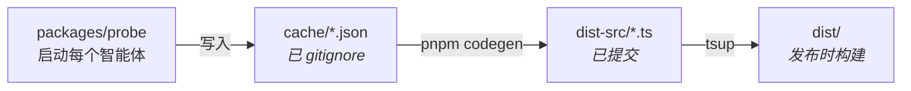

# agent-metadata

[](https://www.npmjs.com/package/acp-agent-metadata)
[](packages/data/dist-src/agents/)

[English](README.md) | **简体中文**

为 [Agent Client Protocol (ACP)](https://agentclientprotocol.com) 编码智能体提供的类型化元数据 —— 包括会话模式、斜杠命令、能力和认证方式，以支持 tree-shaking 的 npm 包形式发布。

## 为什么需要

并非总能实时查询智能体的能力：智能体可能离线、在远程环境中不可达、或为每次请求都启动一遍成本太高。本仓库对每个 ACP 智能体探测一次，再把采集到的元数据以静态、类型化的形式发布，你可以随处导入 —— 无需在线智能体。

探针（`packages/probe`）通过 stdio 启动每个智能体，查询其 `initialize` / `session/new` 响应，并将结果代码生成为 `acp-agent-metadata`。

数据覆盖 **34 个智能体**，包括 `gemini`、`cline`、`cursor`、`claude-acp`、`codex-acp`、`kimi`、`opencode` 和 `goose`。完整列表见 [`packages/data/dist-src/agents/`](packages/data/dist-src/agents/)。

## 包结构

这是一个包含两个包的 pnpm workspace：

| 包名 | 路径 | 是否发布 | 用途 |
| --- | --- | --- | --- |
| `acp-agent-metadata` | [`packages/data`](packages/data) | 是（通过 changesets） | 支持 tree-shaking 的类型化智能体元数据。ESM + CJS，零运行时依赖。 |
| `@agent-metadata/probe` | [`packages/probe`](packages/probe) | 否（`private: true`） | 生成元数据的探针工具。仅在 CI 中使用。 |

## 安装

```bash
npm install acp-agent-metadata
# 或
pnpm add acp-agent-metadata
```

运行时要求 Node.js 22+；开发与 CI 使用 Node 24（见 [`.node-version`](.node-version)）。本包内联了 ACP SDK 类型，因此 `@agentclientprotocol/sdk` **不是**运行时依赖。

## 用法

导入单个智能体（支持 tree-shaking —— 只有该智能体的数据会进入你的打包产物）：

```ts
import { agent } from 'acp-agent-metadata/gemini'

const modes = agent.modes // SessionMode[]
const commands = agent.commands // AvailableCommand[]
const authMethods = agent.authMethods
```

导入完整聚合数据：

```ts
import { agents } from 'acp-agent-metadata'

const clineModes = agents.cline.modes
const ids = Object.keys(agents) // 全部 34 个智能体 id
```

仅导入类型：

```ts
import type { AgentMetadata, AvailableCommand, SessionMode } from 'acp-agent-metadata/types'
```

每个智能体条目遵循 `AgentMetadata` 接口 —— 包含 `id`、`name`、`version`、`protocolVersion`、`agentInfo`、`agentCapabilities`、`authMethods`、`modes`、`currentModeId`、`configOptions` 和 `commands`。

## 数据是如何生成的



1. `packages/probe` 启动每个智能体，使用 ACP 协议通信，并为每个智能体写入一个 `cache/<id>.json`。
2. `packages/data` 运行 `pnpm codegen`，(重新)写入探测结果为 `status: "ok"` 的智能体 —— 并**保留**之前已提交但本次未探测通过的智能体（如需登录或环境特定的失败），因此 CI 不会丢失本地采集到的数据。通过固定的字段白名单映射并生成 `.ts` 源码。
3. `tsup` 将该源码编译为 ESM + CJS，并解析生成 `.d.ts`（SDK 类型已内联）。
4. `dist-src/` 作为可审查的事实来源被提交；`dist/` 已 gitignore，在发布时构建。

`cache/` 是已 gitignore 的中间产物；`dist-src/` 已提交；`dist/` 已 gitignore 并在发布时构建。探测在 CI 上手动触发；见 [`.github/workflows/probe.yml`](.github/workflows/probe.yml)。

## 开发

```bash
pnpm install            # 安装 workspace 依赖
pnpm test               # 运行 vitest（codegen 快照测试）
pnpm build              # tsup → packages/data/dist（基于已提交的 dist-src）
pnpm lint:fix           # eslint . --fix
```

单独重新构建数据包：

```bash
pnpm --filter acp-agent-metadata run build
```

在本地运行探针（写入 `packages/probe/cache/*.json`）：

```bash
cd packages/probe
ACP_DUMMY_AUTH=1 pnpm start                # 探测所有智能体
ACP_AGENTS=kimi ACP_DUMMY_AUTH=1 pnpm start # 探测单个智能体
```

## 贡献

欢迎贡献。在进行非平凡修改前，请先开一个 [issue](https://github.com/JiangWeixian/agent-metadata/issues) 讨论。本仓库使用 [changesets](https://github.com/changesets/changesets) —— 在提交会改变已发布包的 PR 之前，请用 `pnpm changeset` 添加一个 changeset。见 [PR 模板](.github/PULL_REQUEST_TEMPLATE.md)。

## 项目状态

实验性 —— 发布版本采用日期版本号（CalVer，如 `2026.629.0`）。智能体集合、字段结构和包接口可能发生变化。请将数据视为每个智能体在探测时所声明内容的快照，而非稳定契约。

## 许可证

[MIT](LICENSE) —— 完整文本见 [`LICENSE`](LICENSE)。

---

Built with probes and parentheses /ᐠ｡ꞈ｡ᐟ\
