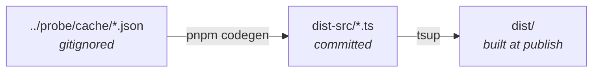

# acp-agent-metadata

[](https://www.npmjs.com/package/acp-agent-metadata)
[](dist-src/agents/)

**English** | [简体中文](README.zh-CN.md)

Type-safe metadata for [ACP](https://agentclientprotocol.com) coding agents — their session modes, slash commands, capabilities, and auth methods — generated from live probes and shipped as ESM + CJS with **zero runtime dependencies**.

This is the publishable package of the [`agent-metadata`](../../README.md) workspace. The probe tool that produces the data lives in [`packages/probe`](../probe).

## Install

```bash
npm install acp-agent-metadata
# or
pnpm add acp-agent-metadata
```

The ACP SDK types are inlined into the generated `.d.ts`, so `@agentclientprotocol/sdk` is a `devDependency` only — consumers install nothing extra.

## Usage

One agent (tree-shakeable; only that agent lands in your bundle):

```ts
import { agent } from 'acp-agent-metadata/gemini'

const modes = agent.modes // SessionMode[]
const commands = agent.commands // AvailableCommand[]
const authMethods = agent.authMethods // AgentAuthMethod[]
```

The full aggregate:

```ts
import { agents } from 'acp-agent-metadata'

const clineModes = agents.cline.modes
const ids = Object.keys(agents) // every probed agent id
```

Types only:

```ts
import type { AgentMetadata, AvailableCommand, SessionMode } from 'acp-agent-metadata/types'
```

## Exports

| Subpath | Exports | Format |
| --- | --- | --- |
| `acp-agent-metadata` | `agents` — all agents keyed by id | ESM + CJS + `.d.ts` |
| `acp-agent-metadata/types` | `AgentMetadata`, `SessionMode`, `AvailableCommand`, and related interfaces | ESM + CJS + `.d.ts` |
| `acp-agent-metadata/<agent-id>` | `agent` — that agent's `AgentMetadata` | ESM + CJS + `.d.ts` |

The per-agent subpaths are regenerated by codegen for every agent that probed `status: "ok"` — currently 34 agents, listed in [`dist-src/agents/`](dist-src/agents/).

## Data shape

```ts
interface AgentMetadata {
  id: string
  name: string
  version: string
  protocolVersion: number
  agentInfo: { name: string; version: string; [key: string]: unknown }
  agentCapabilities: AgentCapabilities
  authMethods: AgentAuthMethod[]
  modes: SessionMode[]
  currentModeId: null | string
  models: AgentModel[]
  currentModelId: null | string
  reasoningEfforts: AgentReasoningEffort[]
  currentReasoningEffortId: null | string
  configOptions: AgentConfigOption[]
  commands: AvailableCommand[]
}

// Flattened, type-safe views derived from configOptions — mirror the modes/currentModeId shape.
interface AgentModel { id: string; name: string; description?: null | string }
interface AgentReasoningEffort { id: string; name: string; description?: null | string }
```

Source of truth: [`src/types.ts`](src/types.ts). `models`, `currentModelId`, `reasoningEfforts`, and `currentReasoningEffortId` are derived from `configOptions` (the `category: "model"` / `id: "model"` and `category: "thought_level"` selects) so consumers get a typed list without casting. `configOptions` itself is preserved verbatim for backward compatibility.

## How it is built



1. [`scripts/codegen.ts`](scripts/codegen.ts) reads each `cache/<id>.json` from the probe package, (re)writes agents that returned `status: "ok"`, and **preserves** any previously committed `dist-src` entries for agents that didn't (so a CI run can't drop locally captured data). Fields are mapped through a fixed allowlist and keys sorted for stable output, then written to `dist-src/*.ts`.
2. [`tsup.config.ts`](tsup.config.ts) compiles `dist-src/` into `dist/` as ESM + CJS, with `dts: { resolve: true }` inlining the SDK types.
3. codegen also rewrites the `exports` map in [`package.json`](package.json) to match the current agent set.

```bash
pnpm codegen     # cache → dist-src/*.ts (also rewrites exports map)
pnpm build       # tsup → dist/ (from committed dist-src)
pnpm typecheck   # tsc --noEmit
pnpm test        # vitest (codegen snapshot tests)
```

`dist-src/` is committed as the reviewable source of truth; `dist/` is gitignored and built at publish time.

## Project status

Experimental — releases use date-based versions (CalVer, e.g. `2026.629.0`). The agent set, field shape, and export surface may change. The data is a snapshot of what each agent advertised at probe time, not a stable contract. Licensed under [MIT](../../LICENSE) — see the root [README](../../README.md) for workspace-wide status.
