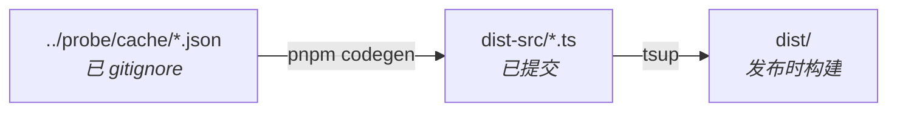

# acp-agent-metadata

[](https://www.npmjs.com/package/acp-agent-metadata)
[](dist-src/agents/)

[English](README.md) | **简体中文**

为 [ACP](https://agentclientprotocol.com) 编码智能体提供的类型安全元数据 —— 包括会话模式、斜杠命令、能力和认证方式。数据由在线探针生成，以 ESM + CJS 形式发布，**零运行时依赖**。

这是 [`agent-metadata`](../../README.md) workspace 中可发布的包。生成数据的探针工具位于 [`packages/probe`](../probe)。

## 安装

```bash
npm install acp-agent-metadata
# 或
pnpm add acp-agent-metadata
```

ACP SDK 类型已内联到生成的 `.d.ts` 中，因此 `@agentclientprotocol/sdk` 仅为 `devDependency` —— 使用者无需安装任何额外依赖。

## 用法

单个智能体（支持 tree-shaking；只有该智能体会进入你的打包产物）：

```ts
import { agent } from 'acp-agent-metadata/gemini'

const modes = agent.modes // SessionMode[]
const commands = agent.commands // AvailableCommand[]
const authMethods = agent.authMethods // AgentAuthMethod[]
```

完整聚合数据：

```ts
import { agents } from 'acp-agent-metadata'

const clineModes = agents.cline.modes
const ids = Object.keys(agents) // 所有已探测的智能体 id
```

仅类型：

```ts
import type { AgentMetadata, AvailableCommand, SessionMode } from 'acp-agent-metadata/types'
```

## 导出

| 子路径 | 导出内容 | 格式 |
| --- | --- | --- |
| `acp-agent-metadata` | `agents` —— 全部智能体，按 id 索引 | ESM + CJS + `.d.ts` |
| `acp-agent-metadata/types` | `AgentMetadata`、`SessionMode`、`AvailableCommand` 及相关接口 | ESM + CJS + `.d.ts` |
| `acp-agent-metadata/<agent-id>` | `agent` —— 该智能体的 `AgentMetadata` | ESM + CJS + `.d.ts` |

每个按智能体的子路径由 codegen 为所有探测结果为 `status: "ok"` 的智能体重新生成 —— 当前为 34 个智能体，列表见 [`dist-src/agents/`](dist-src/agents/)。

## 数据结构

```ts
interface AgentMetadata {
  id: string
  name: string
  version: string
  protocolVersion: number
  agentInfo: { name: string; version: string; [key: string]: unknown }
  agentCapabilities: AgentCapabilities
  authMethods: AgentAuthMethod[]
  modes: SessionMode[]
  currentModeId: null | string
  models: AgentModel[]
  currentModelId: null | string
  reasoningEfforts: AgentReasoningEffort[]
  currentReasoningEffortId: null | string
  configOptions: AgentConfigOption[]
  commands: AvailableCommand[]
}

// 从 configOptions 派生的类型安全视图，与 modes/currentModeId 结构对称
interface AgentModel { id: string; name: string; description?: null | string }
interface AgentReasoningEffort { id: string; name: string; description?: null | string }
```

事实来源：[`src/types.ts`](src/types.ts)。`models`、`currentModelId`、`reasoningEfforts`、`currentReasoningEffortId` 是从 `configOptions`（`category: "model"` + `id: "model"` 和 `category: "thought_level"` 的配置项）派生出来的，消费者无需类型断言即可拿到类型化的列表。`configOptions` 本身原样保留以保证向后兼容。

## 构建方式



1. [`scripts/codegen.ts`](scripts/codegen.ts) 从探针包读取每个 `cache/<id>.json`，(重新)写入返回 `status: "ok"` 的智能体，并**保留**之前已提交但本次未通过的 `dist-src` 条目（这样 CI 不会丢失本地采集的数据）。通过固定的白名单映射字段，对键排序以保证输出稳定，再写入 `dist-src/*.ts`。
2. [`tsup.config.ts`](tsup.config.ts) 将 `dist-src/` 编译为 `dist/`（ESM + CJS），通过 `dts: { resolve: true }` 内联 SDK 类型。
3. codegen 还会重写 [`package.json`](package.json) 中的 `exports` 映射，以匹配当前智能体集合。

```bash
pnpm codegen     # cache → dist-src/*.ts（同时重写 exports 映射）
pnpm build       # tsup → dist/（基于已提交的 dist-src）
pnpm typecheck   # tsc --noEmit
pnpm test        # vitest（codegen 快照测试）
```

`dist-src/` 作为可审查的事实来源被提交；`dist/` 已 gitignore，在发布时构建。

## 项目状态

实验性 —— 发布版本采用日期版本号（CalVer，如 `2026.629.0`）。智能体集合、字段结构和导出接口可能发生变化。数据是每个智能体在探测时所声明内容的快照，而非稳定契约。采用 [MIT](../../LICENSE) 许可证 —— workspace 范围的状态见根目录 [README](../../README.md)。
